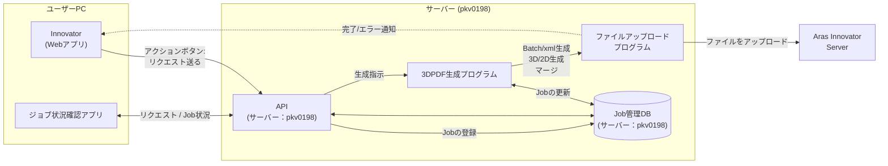
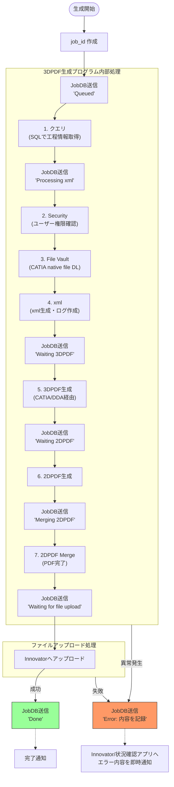

# 3DPDF_Generate

3DPDF and 2DPDF automatically upload from Innovator by using registered Innovator data (Process Information, CATIA Native Files, etc...).

This repository is the **single source of truth** for disaster recovery. Anyone with access to this repo must be able to rebuild the entire environment from scratch.

---

## Repository Structure

```
3DPDF_Generate/
├── env-setup/                     # Environment rebuild configs
│   ├── gpu-dda/                   # Windows GPU (DDA) settings
│   ├── app-configs/               # Application configuration templates
│   ├── shared-folders/            # Network share definitions
│   └── task-scheduler/            # Windows Task Scheduler XML exports
├── src/
│   ├── auto-generator/            # Innovator client → API request sender
│   ├── manual-generator/          # Manual job submission tool
│   ├── api/                       # API server (pkv0199 / pkv0198)
│   └── job-manager/               # Server-side job orchestrator
└── docs/
    ├── operations-log.md          # Operational history
    └── troubleshooting-log.md     # Troubleshooting history
```

---

## System Overview

### Server

| Role | Hostname |
|------|----------|
| Primary generation server | pkv0199 |
| Secondary generation server | pk6513 |

*pk6513は手動版に用いられる、2DPDF生成専用のサーバーである。
 (図面画質問題に対処するため)
 
### System Flow



---

## 2D/3DPDF Job Sequence



---

## Job Status Reference

| Status | Description |
|--------|-------------|
| `Queued` | Job accepted by the API, waiting in queue |
| `Processing 3DPDF` | CATIA is actively generating the 3DPDF |
| `Waiting for file upload` | PDF generated, uploading to Innovator |
| `Done` | Completed successfully |
| `Error` | Failed — check `error_message` in the job record |

---

## Disaster Recovery — Rebuild Checklist

1. **Environment Setup** → See [`env-setup/README.md`](env-setup/README.md)
   - [ ] GPU (DDA) assigned to VM — [`env-setup/gpu-dda/README.md`](env-setup/gpu-dda/README.md)
   - [ ] App configs deployed — [`env-setup/app-configs/README.md`](env-setup/app-configs/README.md)
   - [ ] Shared folders created — [`env-setup/shared-folders/setup.md`](env-setup/shared-folders/setup.md)
   - [ ] Task Scheduler tasks imported — [`env-setup/task-scheduler/README.md`](env-setup/task-scheduler/README.md)
2. **Deploy Source Code** → clone this repo to `C:\3DPDF\` on the server
3. **Configure Applications** → copy `config.example.json` → `config.json` and fill in credentials
4. **Start Services** → Task Scheduler tasks will start the API and Job Manager automatically on next boot, or start manually via Task Scheduler

---

## Documentation

- [Operations Log](docs/operations-log.md)
- [Troubleshooting Log](docs/troubleshooting-log.md)
