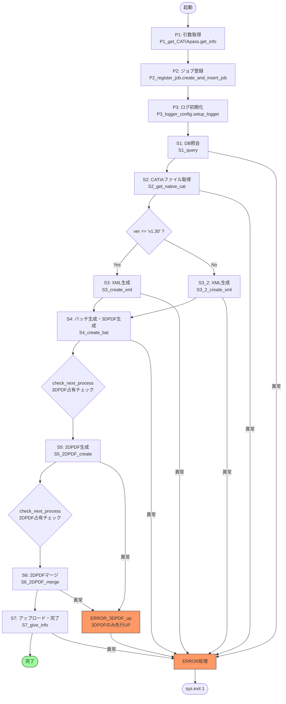

# 3DPDF_gen_py

Aras Innovator と連携し、CATIA ネイティブファイルから **3DPDF / 2DPDF を自動生成**してInnovator へアップロードするサーバーサイドプログラム。

- **メインエントリポイント**: `3DPDF_gen_upload.py`
- **処理単位**: S1〜S7（各ステップモジュール） + ERROR 系（異常処理） + job_db 系（ジョブ管理）

---

## 1. 概要

ユーザーが Innovator 上でアクションボタンを押すと、API 経由でこのプログラムが起動される。  
実行引数（`cadno`, `user_id`, `ver`）を受け取り、以下の一連の処理を順次実行する。

1. Innovator DB から工程情報を照会（S1）
2. CATIA ネイティブファイルをダウンロード（S2）
3. XML を生成（S3 / S3_2）
4. SmartExchange 実行用バッチを生成し 3DPDF を生成（S4）
5. Adobe 経由で 2DPDF を生成（S5）
6. 2DPDF をマージし最終 PDF を確定（S6）
7. Innovator へアップロード・ジョブ完了通知（S7）

異常発生時は ERROR 系モジュールがジョブ状態更新・通知を行い、`sys.exit(1)` で終了する。

---

## 2. 全体処理フロー

`3DPDF_gen_upload.py` の `main_process()` を中心に、以下の順序で処理が進行する。



### 主な分岐・制御

| 制御 | 説明 |
|------|------|
| バージョン分岐 | `ver == 'v1.30'` → `S3_create_xml` / それ以外 → `S3_2_create_xml` |
| 排他制御 | `check_next_process` で 3DPDF / 2DPDF 生成の占有状態を確認し、空くまで待機 |
| キャンセル | Ctrl+C 時は `cancel_process` でジョブ状態を更新して安全に終了 |

---

## 3. ディレクトリ / ファイル構成

```
3DPDF_gen_py/
├── 3DPDF_gen_upload.py      # メインオーケストレーター
├── S1_query.py              # DB照会
├── S2_get_native_cat.py     # CATIAファイル取得
├── S3_create_xml.py         # XML生成 (v1.30)
├── S3_2_create_xml.py       # XML生成 (v1.20系)
├── S4_create_bat.py         # バッチ生成・3DPDF生成
├── S5_2DPDF_create.py       # 2DPDF生成
├── S6_2DPDF_merge.py        # 2DPDFマージ
├── S7_give_info.py          # アップロード・完了通知
├── ERROR.py                 # 共通エラー処理
├── ERROR_3DPDF_up.py        # 3DPDF先行アップロード後エラー処理
└── job_db/
    ├── P1_get_CATIApass.py  # 実行引数の受け取りと分解
    ├── P2_register_job.py   # ジョブ登録
    └── P3_logger_config.py  # ロガー初期化
```

> **注**: `.txt` / `.spec` ファイル、`backup/` `TEST/` `pyarmor/` `venv*/` `build/` `dist/` `__pycache__/` は対象外。

---

## 4. 実行シーケンス（ステップ別）

### 4.1 起動〜初期化

1. `P1_get_CATIApass.get_info` — コマンドライン引数（`cadno`, `user_id`, `ver`）を受け取り分解
2. `P2_register_job.create_and_insert_job` — `job_id` を生成し、SQLite の job テーブルへ INSERT（状態: `Queued`）
3. `P3_logger_config.setup_logger` — コンソール＋ファイル出力のロガーを初期化

### 4.2 メイン処理 (S1〜S7)

| Step | モジュール | 入力 | 出力 |
|------|-----------|------|------|
| S1 | `S1_query` | `cadno`, DB接続情報 | `list_1`〜`list_4`（公開権限、CADファイル、承認情報、工程情報） |
| S2 | `S2_get_native_cat` | `list_1`〜`list_4` | `CAT_TEMP/` へ CATIA ファイルを保存 |
| S3 | `S3_create_xml` | 工程情報、テンプレート | `XML/xml`, `XML/Input`, `XML/Output` へ XML 生成 |
| S3_2 | `S3_2_create_xml` | 工程情報、BOM/MSP 情報 | 同上 (v1.20系向け) |
| S4 | `S4_create_bat` | XML, CATIA ファイルパス | `BATCH/` へバッチファイル生成 → SmartExchange 経由で 3DPDF 生成 → `3DPDF_TEMP/` |
| S5 | `S5_2DPDF_create` | CATIA ファイル | Adobe 経由で `2DPDF_TEMP/` へ 2DPDF 生成（`done.pdf` 監視で完了判定） |
| S6 | `S6_2DPDF_merge` | 3DPDF, 2DPDF | 3DPDF 添付統合 + 2DPDF マージ → `INV/<timestamp>/` へ最終 PDF 配置 |
| S7 | `S7_give_info` | 最終 PDF パス | Innovator へアップロード、LastUser 更新、ジョブ完了更新 (`Done`) |

---

## 5. 各モジュール仕様

### 5.1 `3DPDF_gen_upload.py`

| 項目 | 内容 |
|------|------|
| **役割** | オーケストレーション本体。ジョブ進行管理・排他制御・S1〜S7 の順次呼び出しを行う。 |
| **主な関数** | `main_process()`, `check_next_process()`, `cancel_process()` |
| **入力** | コマンドライン引数（`cadno`, `user_id`, `ver`） |
| **出力** | 各ステップモジュールへの処理委譲、ジョブ状態の逐次更新 |
| **異常時** | `ERROR_main` / `ERROR_main_3dup` を呼び出し。Ctrl+C 時は `cancel_process` を実行。 |

### 5.2 `S1_query.py`

| 項目 | 内容 |
|------|------|
| **役割** | Innovator DB（SQL Server）を照会し、工程情報・CADファイル情報・公開権限・承認情報を取得する。 |
| **主な関数** | メインクエリ関数 |
| **入力** | `cadno`, ODBC 接続情報 |
| **出力** | `list_1`（公開権限）、`list_2`（CADファイル）、`list_3`（承認情報）、`list_4`（工程情報） |
| **異常時** | `ERROR_main` |

### 5.3 `S2_get_native_cat.py`

| 項目 | 内容 |
|------|------|
| **役割** | Innovator Vault から CATIA ネイティブファイルをダウンロードし、CN ルールに基づく保存先ディレクトリへ配置する。 |
| **主な関数** | ファイル取得・保存関数 |
| **入力** | `list_1`〜`list_4`, Vault 接続情報 |
| **出力** | `CAT_TEMP/` 配下に CATIA ファイルを保存 |
| **異常時** | `ERROR_main` |

### 5.4 `S3_create_xml.py`

| 項目 | 内容 |
|------|------|
| **役割** | v1.30 系の XML 生成。工程注記を XML へ整形し、テンプレート切替判定（行数超過時）を行う。 |
| **主な関数** | XML 生成・テンプレート選択関数 |
| **入力** | 工程情報、XML テンプレート |
| **出力** | `XML/xml`, `XML/Input`, `XML/Output` へ XML ファイルを生成 |
| **異常時** | `ERROR_main` |

### 5.5 `S3_2_create_xml.py`

| 項目 | 内容 |
|------|------|
| **役割** | v1.20 系の XML 生成。BOM / MSP 情報照会を含む XML 生成を行う。 |
| **主な関数** | XML 生成関数（BOM/MSP 対応） |
| **入力** | 工程情報、BOM/MSP 情報、XML テンプレート |
| **出力** | `XML/xml`, `XML/Input`, `XML/Output` へ XML ファイルを生成 |
| **異常時** | `ERROR_main` |

### 5.6 `S4_create_bat.py`

| 項目 | 内容 |
|------|------|
| **役割** | SmartExchange 実行用バッチファイルを生成し、シートごとに CAT / XML / PDF パスを組み立てて 3DPDF を生成する。 |
| **主な関数** | バッチ生成・SmartExchange 起動関数 |
| **入力** | XML ファイル, CATIA ファイルパス |
| **出力** | `BATCH/` へバッチファイル生成、`3DPDF_TEMP/` へ 3DPDF 生成 |
| **異常時** | `ERROR_main` |

### 5.7 `S5_2DPDF_create.py`

| 項目 | 内容 |
|------|------|
| **役割** | Adobe Acrobat 経由で 2DPDF を生成する。`done.pdf` の出現を監視し完了を判定する。 |
| **主な関数** | 2DPDF 生成・完了監視関数 |
| **入力** | CATIA ファイル |
| **出力** | `2DPDF_TEMP/` へ 2DPDF を生成 |
| **異常時** | `ERROR_main_3dup`（3DPDF のみ先行アップロード後にエラー処理） |

### 5.8 `S6_2DPDF_merge.py`

| 項目 | 内容 |
|------|------|
| **役割** | 3DPDF 添付統合と 2DPDF マージを行い、Innovator アップロード用の最終ファイル名を確定する。 |
| **主な関数** | PDF マージ・ファイル名確定関数 |
| **入力** | `3DPDF_TEMP/` の 3DPDF, `2DPDF_TEMP/` の 2DPDF |
| **出力** | `INV/<timestamp>/` 配下に最終 2D/3D PDF を配置 |
| **異常時** | `ERROR_main_3dup`（3DPDF のみ先行アップロード後にエラー処理） |

### 5.9 `S7_give_info.py`

| 項目 | 内容 |
|------|------|
| **役割** | アップロード EXE を呼び出して最終 PDF を Innovator へアップロードし、LastUser 更新・ジョブ完了更新を行う。 |
| **主な関数** | アップロード呼び出し・完了通知関数 |
| **入力** | 最終 PDF パス、Innovator 接続情報 |
| **出力** | Innovator へファイルアップロード、ジョブ状態 → `Done` |
| **異常時** | `ERROR_main` |

### 5.10 `ERROR.py`

| 項目 | 内容 |
|------|------|
| **役割** | 共通エラー処理。DB の condition を失敗状態に更新、error 内容を記録、アップロード EXE を呼び出してエラー通知、LastUser を更新する。 |
| **主な関数** | `ERROR_main()` |
| **入力** | 例外情報、ジョブ情報 |
| **出力** | DB 更新（`Error` 状態）、Innovator へエラー通知アップロード |
| **異常時** | — |

### 5.11 `ERROR_3DPDF_up.py`

| 項目 | 内容 |
|------|------|
| **役割** | S5 / S6 失敗時の救済処理。3DPDF のみ先行アップロードしてから `ERROR_main` による本エラー処理を実行する。 |
| **主な関数** | `ERROR_main_3dup()` |
| **入力** | 3DPDF ファイルパス、例外情報 |
| **出力** | 3DPDF を Innovator へアップロード後、`ERROR_main` へ委譲 |
| **異常時** | — |

### 5.12 `job_db/P1_get_CATIApass.py`

| 項目 | 内容 |
|------|------|
| **役割** | 実行引数の受け取りと分解。 |
| **主な関数** | `get_info()` |
| **入力** | コマンドライン引数 |
| **出力** | `cadno`, `user_id`, `ver` 等の変数 |
| **異常時** | 引数不正時にエラー終了 |

### 5.13 `job_db/P2_register_job.py`

| 項目 | 内容 |
|------|------|
| **役割** | `job_id` を生成し、SQLite の job テーブルへ INSERT する。 |
| **主な関数** | `create_and_insert_job()` |
| **入力** | `cadno`, `user_id` 等 |
| **出力** | `job_id`（戻り値）、`job.db` へレコード INSERT |
| **異常時** | DB 書き込み失敗時にエラー終了 |

### 5.14 `job_db/P3_logger_config.py`

| 項目 | 内容 |
|------|------|
| **役割** | コンソール出力＋ファイル出力の二系統ロガーを初期化する。 |
| **主な関数** | `setup_logger()` |
| **入力** | ログファイルパス、ログレベル |
| **出力** | 設定済み logger オブジェクト |
| **異常時** | — |

---

## 6. エラーハンドリング方針

| モジュール | 責務 | 動作 |
|-----------|------|------|
| `ERROR.py` | 共通エラー処理 | DB の condition を `Error` に更新、`error_message` にエラー内容を記録、`ArasCadViewUpload_Rodend.exe` でエラー通知をアップロード、LastUser を更新 |
| `ERROR_3DPDF_up.py` | S5/S6 失敗時の救済 | 3DPDF のみ先行アップロードしてから `ERROR_main` を呼び出し |
| タイムアウト系 | 待機リトライ | 規定回数リトライ後に `Failed` としてエラー処理へ遷移 |

- すべての異常系は最終的に `sys.exit(1)` でプロセスを終了する。
- ジョブ状態は必ず `Error` に更新されるため、状況確認アプリから障害内容を把握可能。

---

## 7. 外部依存

| 用途 | 接続先 | 失敗時の影響 |
|------|--------|-------------|
| ジョブ管理DB | SQLite: `C:\3DPDF\99_3DPDF_generate\job.db` | ジョブ状態の記録・参照不可 |
| 工程情報照会 | SQL Server: `Rodend_PLM`（ODBC Driver 18） | S1 クエリ失敗、生成不可 |
| ジョブ状態通知 API | Web API: `PdfStateSv` | 状況確認アプリへの状態反映不可 |
| LastUser 更新 API | Web API: `LastUserSv` | ユーザー更新情報が反映されない |
| Innovator アップロード | `ArasCadViewUpload_Rodend.exe` | PDF の Innovator 登録不可 |
| 3DPDF 変換 | `SmartExchange.exe` | 3DPDF 生成不可 |
| SmartExchange 起動 | タスクスケジューラ: `exec_SmartExchange_batch` | バッチ経由の 3DPDF 生成不可 |
| 強制終了 | `forced_end.bat` | ハングしたプロセスの強制終了不可 |

---

## 8. 入出力アーティファクト

### 入力

| 種別 | 内容 |
|------|------|
| 実行引数 | `cadno`, `user_id`, `ver` |

### 中間生成物

| ディレクトリ | 内容 |
|-------------|------|
| `CAT_TEMP/` | Vault からダウンロードした CATIA ネイティブファイル |
| `XML/xml` | 生成した XML ファイル |
| `XML/Input` | SmartExchange 入力用 XML |
| `XML/Output` | SmartExchange 出力用 XML |
| `3DPDF_TEMP/` | 生成された 3DPDF |
| `2DPDF_TEMP/` | 生成された 2DPDF |
| `BATCH/` | SmartExchange 実行用バッチファイル |

### 最終出力

| ディレクトリ | 内容 |
|-------------|------|
| `INV/<timestamp>/` | Innovator へアップロードする最終 2D/3D PDF |
| LOG ファイル | 処理ログ（コンソール＋ファイル出力） |

---

## 9. 運用上の注意事項

- **Windows 前提**: Adobe Acrobat およびタスクスケジューラに依存するため、Windows 環境でのみ動作する。
- **グローバル変数**: モジュール間でグローバル変数による値受け渡しが多い。変数名の衝突や意図しない上書きに注意すること。
- **異常終了**: 例外発生時は `sys.exit(1)` でプロセスが終了する。プロセス監視やタスクスケジューラの再起動設定で運用すること。
- **排他制御**: 3DPDF / 2DPDF 生成は `check_next_process` による占有チェックを行うため、複数ジョブが同時にリソースを競合することはない。ただし、占有が解放されない場合はタイムアウトで `Failed` となる。
- **CATIA / GPU**: 3DPDF 生成には CATIA および GPU（DDA 割り当て）が必要。GPU が割り当てられていない場合、SmartExchange が失敗する。
